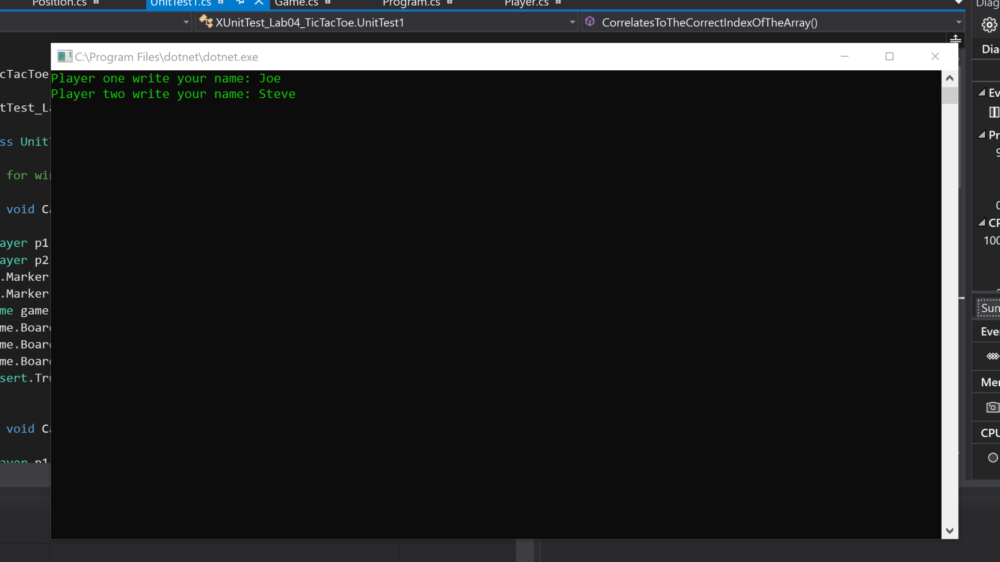
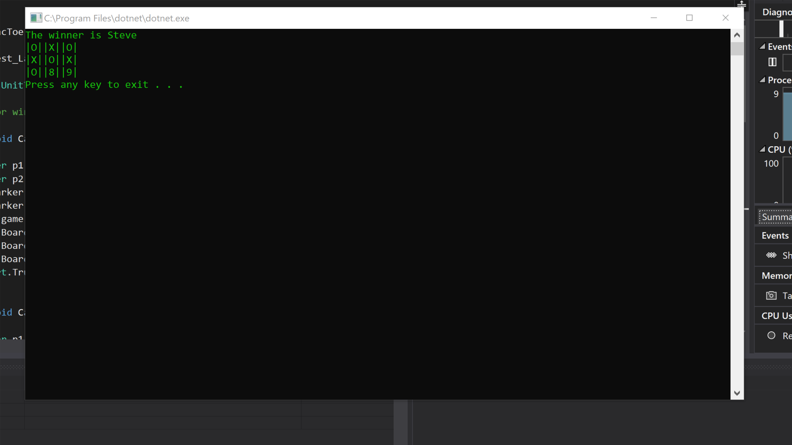
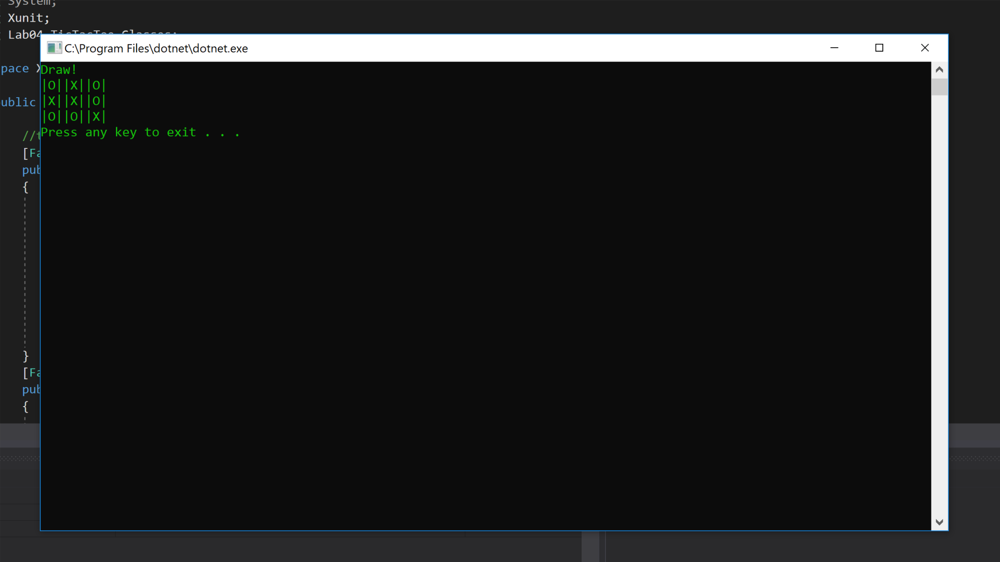

# Lab04_TicTacToe
Console app that allows the user to play Tic-Tac-Toe  
Allows the user to input their name  
Three in a row = win  
no winner = draw  

## Instalation 
To run you need Visual Studio 2017, navigate to /Lab04_TicTacToe/Lab04_TicTacToe/Program.cs open with Visual Studio 2017 then press Ctrl+F5 to compile and run, or click the green arrow on the top toolbar.
## Screenshots
### inputing names:

### Winning:

### Draw:

